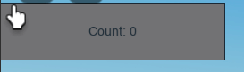

import Tabs from '@theme/Tabs';
import TabItem from '@theme/TabItem';

# Basic click counter
use `$render` to render an element. The parent is specified when it is mounted or is inferred when used as an element.


<Tabs>

<TabItem value="Typescript">

```tsx
import ezui, { $effect, $fnc, $mount, $prop, $render, $state, FCProps, getter, setter } from "@rbxts/ezui-core";

namespace main {
	let count = $state(0); // declare count
	function updateCount() {
		count += 1; // we can just use `count` like a normal variable
	}
	$render(
		<screengui>
			<textbutton
				// listen for clicks
				onMouseButton1Click={updateCount}
				// this will automatically update whenever `count` changes
				Text={`Count: ${count}`}
				Size={new UDim2(0, 200, 0, 50)}
			/>
		</screengui>,
	);
}

export = (target: Instance) => {
	const mounted = $mount(main, target);

	return () => {
		for (const instance of mounted) {
			instance.Destroy();
		}
	};
};
```

</TabItem>
<TabItem value="Result">



</TabItem>
<TabItem value="Luau emit">

```lua
-- Compiled with roblox-ts v2.2.0
local TS = require(game:GetService("ReplicatedStorage"):WaitForChild("rbxts_include"):WaitForChild("RuntimeLib"))
local ezui = TS.import(script, game:GetService("ReplicatedStorage"), "rbxts_include", "node_modules", "@rbxts", "ezui", "out")
local function main(__props__, __parent__)
	ezui.push(__props__)
	local count = ezui.source(0)
	local function updateCount()
		ezui.set(count, ezui.get(count) + 1)
	end
	local screengui = Instance.new("ScreenGui")
	screengui.Parent = __parent__
	local textbutton = Instance.new("TextButton")
	textbutton.Parent = screengui
	textbutton.MouseButton1Click:Connect(updateCount)
	textbutton.Text = "Count: " .. tostring(ezui.get(count))
	ezui.render_effect(function()
		textbutton.Text = "Count: " .. tostring(ezui.get(count))
	end)
	textbutton.Size = UDim2.new(0, 200, 0, 50)
	ezui.pop()
	return { screengui }
end
return function(target)
	local mounted = main({}, target)
	return function()
		for _, instance in mounted do
			instance:Destroy()
		end
	end
end
```

</TabItem>
</Tabs>
